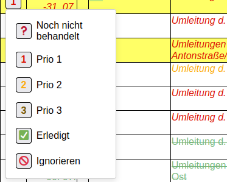

# PimpMyIBSEList

&copy; 2025 Pieter Hollants &lt;pieter klammeraffe hollants.com&gt;

**Dieses Skript nützt nur halbwegs technisch versierten IBSE-Mitgliedern!!!**

## Was ist IBSE?

Wenn du das nicht weißt, ist das hier eh uninteressant für dich ;)

## Wos isch des?

PimpMyIBSEList ist ein Tampermonkey/Violetmonkey User Script, mit dem die IBSE-Liste eine Komfortfunktion gewinnt, nämlich das persönliche Klassifizieren von Listeneinträgen. Heißt auf Deutsch: man kann jedem Listeneintrag einen Status zuweisen, darunter die eigene Priorität von 1 bis 3, ein "hab ich schon" oder ein "Ignorieren".

Die vorgenommene Klassifizierung ist dabei innerhalb des Webbrowsers bzw. Webbrowser-Profils persistent, d.h. sie wird ähnlich einem Cookie lokal gespeichert und bleibt somit auch bei folgenden Aufrufen der Liste erhalten (es sei denn man lässt beim Browser beenden automatisch alle Websitedaten löschen).

## Was bringt mir das?

Mehr Übersicht: man erkennt viel einfacher, welche Listeneinträge für einen irrelevant sind, weil man die Strecke schon hat oder das Land nicht zum Sammelgebiet gehört, und welche wichtiger sind als andere.

## Das brauche ich nicht!

Prima, dann installier es nicht.

## Was brauche ich?

- Einen halbwegs aktuellen Firefox auf PC/Desktop, egal ob Windows oder Linux -- Chrome habe ich nicht getestet
- Die [VioletMonkey](https://addons.mozilla.org/de/firefox/addon/violentmonkey/)-Erweiterung, einfach im Firefox Erweiterungsmanager installieren. Diese Browsererweiterung ermöglicht es überhaupt erst, sogenannte "User scripts" zu schreiben, die beim Laden bestimmter Webseiten automatisch ausgeführt werden sollen, um diese zu modifizieren. TamperMonkey geht auch, aber VioletMonkey ist Open Source.
- Sobald VioletMonkey installiert ist, geht man auf [die Skriptseite bei Github](https://github.com/pief/pimpmyibselist/blob/main/PimpMyIBSEList.user.js) und klickt rechts oben auf den "Raw"-Knopf. VioletMonkey bietet dann automatisch die Installation an.
- Danach auf die IBSE-Liste gehen und oho!

## Moooment... ich soll irgendwas installieren?!

Ohne die VioletMonkey-Erweiterung ist es leider ohne weiteres nicht möglich, so bequem Skripte laufen zu lassen, die eine Webseite verändern. Die liegt als Open Source vor, kann also jeder auf bösartigen Code inspizieren, der Code lesen kann.

## Und dann?

Jeder Listeneintrag hat nun links einen Button bekommen, der den aktuellen Zustand des Eintrags anzeigt: unbehandelt (neu bzw. nicht geändert), Priorität 1, 2 oder 3, "Hab ich schon" oder "Ignorieren". Einfach auf das jeweilige Symbol klicken, dann kann man den Zustand ändern und die Gestaltung des Listeneintrags ändert sich entsprechend. Die Zustandsänderung wird automatisch gespeichert.

## Cool, synchronisiert das auch auf dem Handy, dem Zweit-PC oder meinem zweiten Browserprofil?

Leider nein: genauso wie Cookies werden die Daten nicht automatisch repliziert, selbst wenn man Firefox Sync nutzt.

Davon abgesehen läuft VioletMonkey auf Firefox für Android leider ohnehin nicht richtig. Ich hätte auch gerne unterwegs Zugriff auf die gepimpte Liste gehabt, aber so muss halt der Laptop mit auf Reisen.

## Oida, des isch so bunt, mir gefallen die Farben nicht!

Dann mach einen Verbesserungsvorschlag, wie man es besser darstellen kann.

## Ich brauch keine drei Prioritäten, eine reicht!

Dann nutz nur Prio 1, fertig.

## Dein Skript verrät Vereinsinterna !!1

Nein.

## Das Skript funktioniert bei mir nicht bzw. ich habe einen Fehler gefunden!

Dann mach ein Github-Issue auf oder schreib mir einfach eine Mail.

## Technischer Hintergrund

Eigentlich™ ist die gebotene Funktion eine, die der Mitgliederbereich selbst bieten sollte. Mit persönlichen Logins ließe sich der Zustand der Listeneinträge wunderbar serverseitig ablegen und stünde in allen Browsern zur Verfügung.

Leider ist die Welt aber nicht so einfach, deswegen habe ich die Funktion stattdessen clientseitig implementiert, d.h. sie läuft als JavaScript-Code *rein im lokalen Webbrowser*, wenn die Seite geladen wird. Das Skript modifiziert dazu den Quellcode der Seite passend. Und ja, das bedeutet natürlich auch, dass es bei Änderungen an der Seitenstruktur angepasst werden müsste.

Die gewählte Zustände der Listeneinträge werden im `localStorage` des Browsers persistiert. "Local" impliziert schon: im lokalen Browser. Genau so wie IndexedDB wird dies von Firefox Sync leider nicht mit synchronisiert.
